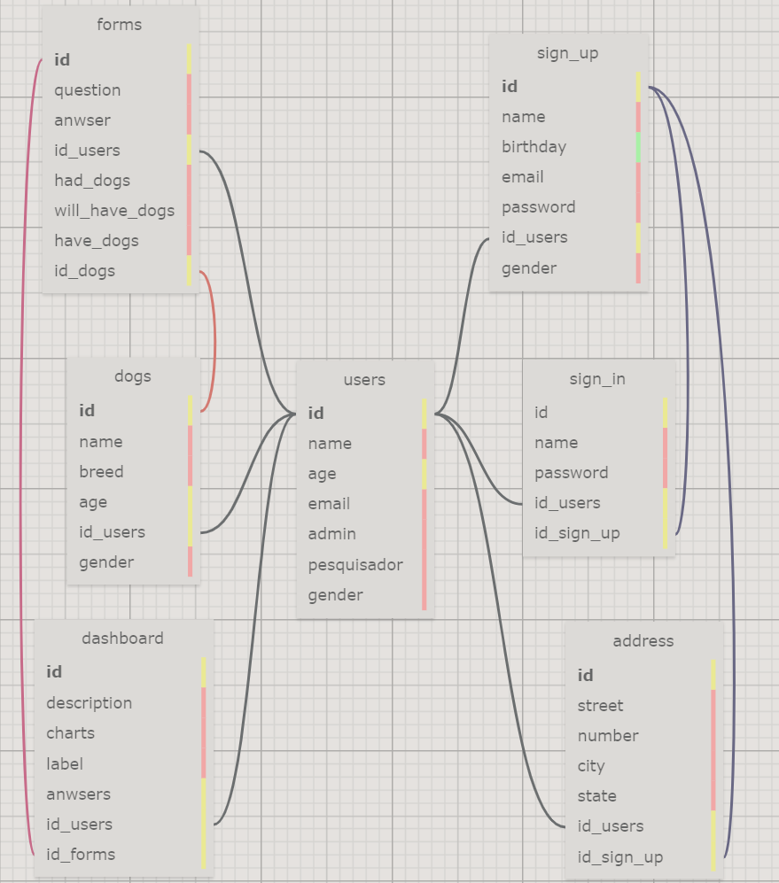

# Modelagem do banco de dados
## SQL Designer


## Entidades 
### Users
&nbsp;&nbsp;&nbsp;&nbsp; Entidade central do modelo, em que todas as conexões são efetuadas. Contém os seguintes atributos:
- ``` id: ``` Código de identificação único para cada usuário
- ```name: ```Nome criado pelo usuário para ser identificado na plataforma
- ```age:``` Idade do usuário
- ```email:``` Email fornecido pelo usuário para efetuar a autenticação da conta e através do qual a comunicação com a plataforma será estabelecida
- ```admin:``` Opção de administrador para usuários cadastrados com essa responsabilidade
- ```pesquisador:``` Opção de conta para usuários não administradores
---

### sign_up
&nbsp;&nbsp;&nbsp;&nbsp; Tabela destinada ao cadastro do usuário, caso ainda não tenha uma conta. É associada à tabela ```users``` através de uma conexão ```id_users```, referenciando um usuário para cada cadastro. Apresenta os seguintes atributos:
- ```id:``` Código de identificação único para o cadastro
- ```name:``` Nome do usuário que será utilizado pela plataforma
- ```birthday:``` Data de nascimento do usuário
- ```password:``` Senha criado pelo usuário para acessar o site
- ```email:``` Email adicionado pelo usuário para autenticar sua conta
- ```id_users:``` Conexão com a tabela users, sendo um cadastro por usuário
- ```gender:``` Gênero biológico selecionado pelo usuário (Masculino, feminino)

---

### sign_in
&nbsp;&nbsp;&nbsp;&nbsp; A tabela sign_in é destinada aos usuários que já possuem cadastro e pretendem acessar sua conta. Compartilha os atributos ```name```, ```age``` e ```password```. Possui conexões com a tabela ```users```, ```sign_up``` e ```address```. Estão inclusos os seguintes atributos:
- id: Código de identificação único por sign_in
- name: Nome de usuário
- password: Senha determinada durante o cadastro
- id_users: Relação com a tabela users, sendo uma conta por usuário
- id_sign_up: Relação com a tabela sign_up, sendo um usuário por conta cadastrada


---

### address
&nbsp;&nbsp;&nbsp;&nbsp; A tabela ```address``` referecia um endereço por usuário, sendo definido no momento de cadastro, portanto a conexão com a tabela ```sign_up```. Seus dados são automaticamente ativados no momento de sign_in. Possui os seguintes atributos:
- id: Código de identificação único por endereço cadastrado
- street: Rua do endereço
- number: Número da rua
- state: Estado do endereço
- city: Cidade do endereço
- id_users: Relação com a tabela users, sendo um endereço por usuário
- id_sign_up: Relação com a tabela sign_up, sendo um endereço por conta cadastrada
  

---

### forms
&nbsp;&nbsp;&nbsp;&nbsp; A tabela ```forms``` representa o formulário da aplicação web que será preenchido pelo usuário. É composta pelos seguintes atributos:
- question: Referencia as perguntas do formulário
- anwser: Referencia as respostas para as perguntas do formulário
- had_dogs: Representa a opção selecionada por usuários que já tiveram um cachorro
- will_have_dogs: Representa a opção selecionada por usuários que pretendem ter um cachorro
- have_dogs:  Representa a opção selecionada por usuários que possuem um cachorro

&nbsp;&nbsp;&nbsp;&nbsp; Essa tabela faz uma conexão única com os users, recebendo id_users e id_dogs para efetuar a conexão dos dados.

---

### dogs
&nbsp;&nbsp;&nbsp;&nbsp; Essa tabela referencia os cachorros que serão adicionados ao banco de dados. É composta pelos seguintes atributos:
- id: Código de identificação único para cada cachorro cadastrado
- name: Nome do cachorro 
- breed: Raça do cachorro
- age: Idade do cachorro
- id_users: Relação com a tabela users, sendo um cachorro para um dono
- gender: Sexo do cachorro

---

### dashboard
&nbsp;&nbsp;&nbsp;&nbsp; A tabela dashboard representa uma visualização exclusiva para os usuários administradores. Através de suas relações os usuários são capazes de adquirir dados da aplicaão web e ajustar determinadas configurações. Seus atributos são:
- id: Código de identificação exclusivo para cada dashboard
- description: Descrição relativa aos dados obtidos pela aplicação web
- charts: Gráficos que traduzem os dados coletados de forma interativa e visualmente mais compreensível
- labels: Servem como tags para identificar e filtrar os dados coletados
- anwsers: Guarda as respostas das perguntas do formulário atribuídas pelos usuários
- id_users: Relação com a tabela users, sendo um dashboard por usuário
- id_forms: Relação com a tabela forms, podendo haver mais de um formulário para cada dashboard
  
